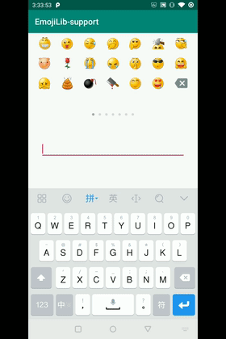

# EmojiLib
A library for showing emoji in Android.

## How to use it 

It's very easy to use.

In xml layout

    <com.cwb.libemoji.ui.FaceLayout
          android:id="@+id/face_layout"
          android:layout_width="match_parent"
          android:layout_height="200dp" />

In class

    face_layout.setOnFaceClickListener(object : OnFaceClickListener {

        override fun onClick(bean: FaceBean) {
            val text = "... ${bean.content}"
            FaceCenter.showFace(tv_face, text, 30f)
        }

        override fun onDelete() {
            FaceCenter.deleteFace(tv_face, 30f)
        }

    })
	
EditText delete event listener:
	
	editText.setOnKeyListener { v, keyCode, _ ->
		if (keyCode == KeyEvent.KEYCODE_DEL) {
			FaceCenter.deleteFace(v as EditText, 30f)
			true
		} else
			false
    }
  
## Add EmojiLib to your project.

    allprojects {
      repositories {
        
        maven { url 'https://jitpack.io' }
      }
    }

	implementation 'com.github.codwb:EmojiLib:Tag'

  
### If you need android-support lib

  [Android-support Version](https://github.com/codwb/EmojiLib-support)
